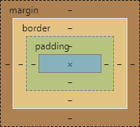
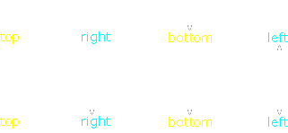

<link rel="stylesheet" href="https://zhmhbest.gitee.io/hellomathematics/style/index.css">
<script src="https://zhmhbest.gitee.io/hellomathematics/style/index.js"></script>

# [CSS](../index.html)

[TOC]

## 引入样式

```html
<link rel="stylesheet" type="text/css" href="style.css" />
```

## 显示方式

| 样式 | 说明 | 例子 |
| --: | :- | :- |
| `none`       | 元素不会被显示 |  |
| `block`      | **块级元素**独占一行。 | `p`、`h1`、`h2`、`h3`、`br`、`div` |
| `inline`     | **内联元素**只占自身的宽度。 | `a`、`span` |
| `inline-block` | **行内块元素**既能设置宽高，也不会独占一行。 | `img`、`iframe` |
| `inherit`    | 继承自父元素 |  |

```html
<div style="display: block;"></div>
```

## 隐藏元素

```css
? {
    /* 方法1：不占据页面空间 */
    display: none;

    /* 方法2：占据页面空间，无法点击 */
    visibility: hidden;
    /* visibility: visible; */

    /* 方法3：占据页面空间，可以点击 */
    opacity: 0;
    /* opacity: 1; */
}
```

## 选择器

|                 | 说明       |
| --------------: | :--------- |
|          `* {}` | 通配选择器 |
|    `TagName {}` | 标签选择器 |
| `.ClassName {}` | 类选择器   |
|        `#ID {}` | ID选择器   |

|                 | 说明                         | 例子                |
| --------------: | :--------------------------- | :------------------ |
|      `S1,S2 {}` | 并集                         | `h1,h2,h3`          |
|       `S2S2 {}` | 交集                         | `div#id`、`div.cls` |
| `S2:not(S2) {}` | 排除                         | `.hint:not(h1,h2)`  |
|      `S1+S2 {}` | 首平（后一个紧挨的平级标签） | `h2+p`              |
|      `S1~S2 {}` | 平辈（之后所有的平级标签）   | `h1~h2`             |
|      `S1>S2 {}` | 子代（孙代不算）             | `tr>td`             |
|      `S1 S2 {}` | 后代（孙代也算）             | `table td`          |

|                   伪类 | 说明                           |
| ---------------------: | :----------------------------- |
|            `a:link {}` | 未访问过的链接                 |
|         `a:visited {}` | 访问过的链接，只能设置字体颜色 |
|           `S:hover {}` | 鼠标悬停时样式                 |
|          `S:active {}` | 鼠标点击时样式                 |
|       `input:focus {}` | 文本框获得焦点时样式           |
|      `S::selection {}` | （Chrome）选中的文字样式       |
| `S::-moz-selection {}` | （Firefox）选中的文字样式      |
|     `S:first-child {}` | （当前容器内）第一个子元素     |
|      `S:last-child {}` | （当前容器内）最后一个子元素   |
|    `S:nth-child(n) {}` | （当前容器内）第n个子元素      |
| `S:nth-child(even) {}` | （当前容器内）偶数位置         |
|  `S:nth-child(odd) {}` | （当前容器内）奇数位置         |
|   `S:first-of-type {}` | 第一个元素                     |
|    `S:last-of-type {}` | 最后一个元素                   |
|     `S:nth-of-type {}` | 第n个元素                      |

|                                    伪元素 | 说明               |
| ----------------------------------------: | ------------------ |
|                       `p:first-letter {}` | 首字母样式         |
|                         `p:first-line {}` | 首行样式           |
|   `p:before  {content:"[前]";color:red;}` | 每行之前，添加内容 |
| `p:after  {content:"[后]";color:orange;}` | 每行之后，添加内容 |

|                 属性 | 说明                                              |
| -------------------: | ------------------------------------------------- |
|            `S[A] {}` | 含有指定属性的元素                                |
|       `S[A1][A2] {}` | 同时含有属性A1和A2的元素                          |
|    `S[A="value"] {}` | 含有指定属性且，值为value的元素                   |
|   `S[A|="value"] {}` | 含有指定属性且，值为value或值以value开头的元素    |
|    `S[A^="head"] {}` | 含有指定属性且，值以head开头的元素                |
|    `S[A$="tail"] {}` | 含有指定属性且，值以tail结尾的元素                |
| `S[A*="content"] {}` | 含有指定属性且，值包含content的元素               |
| `S[A~="content"] {}` | 含有指定属性且，值以空格断句时可出现content的元素 |

## 长度单位

| Value  | Explain |
| :- | :-: |
| px | 像素
| cm | 厘米
| mm | 毫米
| in | 英寸

| Value  | Explain |
| :-  | :-: |
| %   | 100% = 包含块的高或宽
| em  | 1 em = 1 当前元素的 font-size
| rem | 1 rem = 1 根元素的 font-size

## 颜色

[颜色表](html/color.html)

```css
? {
    /* 颜色名
     *   #RRGGBB
     *   rgb(<num:[0, 255]>, <num:[0, 255]>, <num:[0, 255]>)
     *   rgba(<num:[0, 255]>, <num:[0, 255]>, <num:[0, 255]>, <num:[0, 1]>)
     *
     *   rgb(<num:[0, 100]%>, <num:[0, 100]%>, <num:[0, 100]%>)
     *   rgba(<num:[0, 100]%>, <num:[0, 100]%>, <num:[0, 100]%>, <num:[0, 100]%>)
     *
     *   hsl(<num:[0, 360]>,  <num:[0, 100]%>,  <num:[0, 100]%>)
     *   hsla(<num:[0, 360]>,  <num:[0, 100]%>,  <num:[0, 100]%>,  <num:[0, 100]%>)
     */
    /* 前景色 */
    color: pink;

    /* 背景色 */
    background-color: gold;
}
```

## 字体

```css
? {
    /* 字体类型： Serif | Sans-serif | Monospace | Cursive | Fantasy */
    font-family: Serif;
    /* 可用逗号同时指定多个字体类型 */

    /* 字体风格： normal | italic:斜体 | oblique:倾斜 */
    font-style: normal;

    /* 字体变形： normal | small-caps:小型大写字母 */
    font-variant: normal;

    /* 字体加粗： normal | bold | <number:[100, 900]>:加粗等级 */
    font-weight: normal;

    /* 字体大小： 长度单位 */
    font-size: 100%;

    /* 简写 */
    /* font: style family; */
    /* font: style weight size family; */
}
```

## 盒子模型



```css
? {
    /* 内边距 */
    padding: top right bottom left;

    /* 边框 */
    border: width style color;
    border-width: top right bottom left;
    border-style: top right bottom left;
    border-color: top right bottom left;

    /* 外边距 */
    margin: top right bottom left;
}
```



| `border-style` | 效果 |
| --:     | :-- |
| `none` | 无边框 |
| `hidden` | 无边框，用于解决`table`边框冲突 |
| `dotted` | 点状 |
| `dashed` | 虚线 |
| `solid` | 实线 |
| `double` | 双线 |
| `inherit` | 从父元素继承 |

### 垂直外边距折叠及传递

**相邻兄弟元素之间的垂直外边距以最大值决定**:

@import "src/marginfold/demo-max.html"

```css
.box1 { margin-bottom: 100px; background: DarkCyan; }
.box2 { margin-top: 50px; background: HotPink; }
```

**子元素的上外边距会传递给父元素**：

@import "src/marginfold/demo-top.html"

```css
.box1 { background: DarkCyan; }
.box2 { margin-top: 50px; background: HotPink; }
```

**解决外边界传递**：

@import "src/marginfold/demo-resolve.html"

```css
.box1 { background: DarkCyan; }
.box2 { margin-top: 50px; background: HotPink; }

.box1:before { content: ''; display: table; }
```

### 内容溢出

```css
? {
    overflow: ?; /* visible | hidden | scroll | auto */

    overflow-x: scroll; /* 允许横向滚动 */
    overflow-y: scroll; /* 允许纵向滚动 */
}

/* 整个滚动条 */
::-webkit-scrollbar {}
/* 箭头 */
::-webkit-scrollbar-button {}
/* 滑块 */
::-webkit-scrollbar-thumb {}
/* 轨道 */
::-webkit-scrollbar-track {}
/* 没有滑块的轨道部分 */
::-webkit-scrollbar-track-piece {}
/* 垂直滚动条和水平滚动条时交汇的部分 */
::-webkit-scrollbar-corner {}
```

@import "src/overflow/demo.css"

**直接可见**：

@import "src/overflow/demo-visible.html"

**不可见**：

@import "src/overflow/demo-hidden.html"

**增加滚动条**：

@import "src/overflow/demo-scroll.html"

**溢出后再自动增加滚动条**：

@import "src/overflow/demo-auto.html"

## 布局

### Position

```css
? {
    /*
        relative: 以本身为定位对象进行偏移
        absolute: 以父对象的padding为定位起始进行偏移
        fixed   : 以body为定位对象的特殊absolute
    */
    position: ?;

    /* 偏移量，只取其二 */
    top: ?;
    left: ?;
    right: ?;
    bottom: ?;

    /* 显示层级，越大越靠上，可取负值 */
    z-index: ?;
}
```

### [Float](./src/float.html)

**子元素不能撑开父元素**：

@import "src/float/demo-collapse.html"

**解决浮动塌陷1**：

@import "src/float/demo-resolve1.html"

```css
.ResolveCollapse1 {
    overflow: hidden;
}
```

**解决浮动塌陷2**：

@import "src/float/demo-resolve2.html"

```css
.ResolveCollapse2:after {
    content: '';
    display: table;
    clear: both;
}
```

### Flex

**Block容器**：

@import "src/flex/demo-container-block.html"

**Flex容器**：

@import "src/flex/demo-container-flex.html"

**容器属性**：

```css
? {
    /* 主轴方向: 左右水平(默认) | 右左水平 | 上下垂直 | 下上垂直 */
    flex-direction: row | row-reverse | column | column-reverse;

    /* 一行排不下时如何换行: 不换行（默认） | 换行，第一行在上方 | 换行，第一行在下方 */
    flex-wrap: nowrap | wrap | wrap-reverse;

    /* 缩写 <flex-direction> <flex-wrap> */
    /* flex-flow: <flex-direction> <flex-wrap>; */

    /* 水平如何对齐: 左（默认） | 右 | 中 | 两端 | 假两端 */
    justify-content: flex-start | center | flex-end | space-between | space-around;

    /* 垂直如何对齐: 头 | 尾 | 中心轴 | 文本低端 | 占满高度（默认） */
    align-items: flex-start | center | flex-end | baseline | stretch;

    /* 多轴对齐: 双轴起点 | 双轴终点 | 居中 |　两端 | 假两端 | 占满交叉轴（默认） */
    align-content: flex-start | center | flex-end | space-between | space-around | stretch;
}
```

@import "src/flex/demo-justify-content.html"

@import "src/flex/demo-align-items.html"

@import "src/flex/demo-align-content.html"

**子对象属性**：

```css
? {
    /* 项目排列顺序，顺序越小越靠前 */
    order: <integer>;

    /* 项目的放大比例，默认为0 */
    flex-grow: <number>;

    /* 项目的缩小比例，默认为1 */
    flex-shrink: <number>;

    /* 在分配多余空间之前，项目占据的主轴空间 */
    flex-basis: <length> | auto;

    /* 缩写 <flex-grow> <flex-shrink> <flex-basis> */
    flex: 0 1 auto;

    /* 允许单个对象有与其他对象不一样的对齐方式 */
    align-self: auto | flex-start | flex-end | center | baseline | stretch;
}
```

**应用**：

```css
/* 容器为一行（子对象按列排布） */
.row {
    display: flex;
    flex-wrap: wrap;
    flex-direction: row;
}

/* 容器为一列（子对象按行排布） */
.col {
    display: flex;
    flex-wrap: wrap;
    flex-direction: column;
}
```

<iframe style="width: 500px; height: 1250px; border:none" src="src/flex/flex-dice.html"></iframe>

## Media

```html
<meta name="viewport" content="width=device-width, initial-scale=1.0, maximum-scale=1.0, user-scalable=no">
<!--
    width        ：宽度
    initial-scale：初始的缩放比例
    minimum-scale：允许用户缩放到的最小比例
    maximum-scale：允许用户缩放到的最大比例
    user-scalable：用户是否可以手动缩放
-->
```

`min-width` & `max-width`：

| width | 效果                                                         |
| :---: | :----------------------------------------------------------- |
|  119  | <iframe style="width: 119px; height: 20px; border:none" src="src/media/demo-width.html"></iframe> |
|  120  | <iframe style="width: 120px; height: 20px; border:none" src="src/media/demo-width.html"></iframe> |
|  121  | <iframe style="width: 121px; height: 20px; border:none" src="src/media/demo-width.html"></iframe> |
|  239  | <iframe style="width: 239px; height: 20px; border:none" src="src/media/demo-width.html"></iframe> |
|  240  | <iframe style="width: 240px; height: 20px; border:none" src="src/media/demo-width.html"></iframe> |
|  241  | <iframe style="width: 241px; height: 20px; border:none" src="src/media/demo-width.html"></iframe> |

```css
/* 默认 */
body {
    background-color: darkcyan;
}
/* 可视宽度 [120, 240) */
@media screen and (min-width:120px) and (max-width:240px) {
    body {
        background-color: springgreen;
    }
}
/* 可视宽度 [0, 120) */
@media screen and (max-width:120px) {
    body {
        background-color: hotpink;
    }
}
```

`orientation`：

| 方向 | 效果                                                         |
| ---: | :----------------------------------------------------------: |
| 横屏 | <iframe style="width: 240px; height: 120px; border:none" src="src/media/demo-orientation.html"></iframe> |
| 竖屏 | <iframe style="width: 120px; height: 240px; border:none" src="src/media/demo-orientation.html"></iframe> |

```css
/* 横屏 */
@media screen and (orientation:landscape) {
    body {
        background-color: hotpink;
    }
}
/* 竖屏 */
@media screen and (orientation:portrait) {
    body {
        background-color: darkcyan;
    }
}
```

**横屏分类**：

```css
@media screen and (min-width: 1200px) {
    /*  */
}
@media screen and(min-width: 960px) and (max-width: 1199px) {
    /*  */
}
@media screen and(min-width: 768px) and (max-width: 959px) {
    /*  */
}
@media screen and(min-width: 480px) and (max-width: 767px) {
    /*  */
}
@media screen and (max-width: 479px) {
    /*  */
}
```
