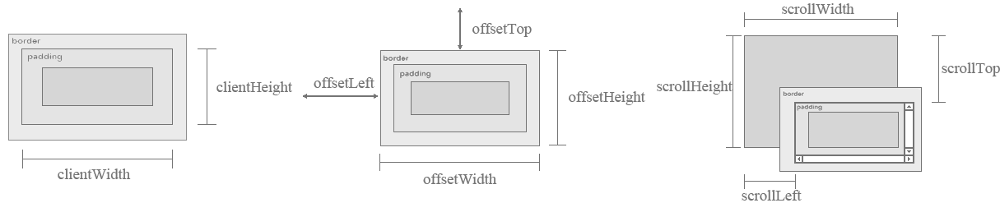

<link rel="stylesheet" href="https://zhmhbest.gitee.io/hellomathematics/style/index.css">
<script src="https://zhmhbest.gitee.io/hellomathematics/style/index.js"></script>

# [WebJS](../index.html)

[TOC]

## Screen



```js
document.documentElement.clientWidth
document.documentElement.clientHeight

document.documentElement.offsetWidth
document.documentElement.offsetHeight
document.documentElement.offsetLeft
document.documentElement.offsetTop

document.documentElement.scrollWidth
document.documentElement.scrollHeight
document.documentElement.scrollLeft
document.documentElement.scrollTop
```

```js
/**
 * 获取dom大小
 * @function
 * @returns {Array<Array<number, number>, Array<number, number>>}
 */
const getDocumentRect = () => {
    return [
        [
            document.documentElement.clientLeft,
            document.documentElement.clientTop
        ], [
            document.documentElement.clientWidth,
            document.documentElement.clientHeight
        ]
    ]
};
```

```js
/**
 * @callback onScreenResize
 * @param {number} width
 * @param {number} height
 * @return {void}
 */
/**
 * 窗口尺寸调整响应
 * @function
 * @param {onScreenResize} fn
 * @return {void}
 */
const pushOnScreenResize = (fn) => {
    const pr = window.onresize;
    if (null === pr || undefined === pr) {
        /**
         * @this {GlobalEventHandlers}
         * @param {UIEvent} ev
         */
        window.onresize = function(ev) {
            fn(document.documentElement.clientWidth, document.documentElement.clientHeight);
        };
    } else {
        /**
         * @this {GlobalEventHandlers}
         * @param {UIEvent} ev
         */
        window.onresize = function (ev) {
            pr.call(this, ev);
            fn(document.documentElement.clientWidth, document.documentElement.clientHeight);
        };
    }
};
pushOnScreenResize((w, h) => {
    console.log(1, w, h);
});
pushOnScreenResize((w, h) => {
    console.log(2, w, h);
});
```

## Hash

```js
/**
 * @callback onHashChange
 * @param {string} value
 * @return {void}
 */
/**
 * 连接Hash改变
 * @function
 * @param {onHashChange} fn
 * @return {void}
 */
 const pushOnHashChange = (fn) => {
    const pr = window.onhashchange;
    if (null === pr || undefined === pr) {
        /**
         * @this {WindowEventHandlers}
         * @param {Event} ev
         */
        window.onhashchange = function(ev) {
            fn(window.location.hash.toString().substr(1));
        };
    } else {
        /**
         * @this {WindowEventHandlers}
         * @param {Event} ev
         */
        window.onhashchange = function (ev) {
            pr.call(this, ev);
            fn(window.location.hash.toString().substr(1));
        };
    }
};
pushOnHashChange((v) => {
    console.log(1, v);
});
pushOnHashChange((v) => {
    console.log(2, v);
});
```

```js
/**
 * @dependency String.splitFirst
 * @dependency String.parseUrlForm
 * 读取Hash中的数据
 * @function
 * @param {string} hashValue
 * @return {object}
 */
const getHashParamsData = (hashValue) => {
    const [, v] = hashValue.splitFirst('?');
    return v.parseUrlForm();
};

/**
 * @dependency String.splitFirst
 * @dependency Object.stringify
 * 设置Hash中的数据
 * @function
 * @param {object} params
 * @return {void}
 */
const setHashParamsData = (params) => {
    const hashValue = window.location.hash.toString().substr(1);
    const [v, ] = hashValue.splitFirst('?');
    window.location.hash = `${v}?${params.stringify()}`;
};

// demo
(() => {
    setHashParamsData({x: 0, y: [1, 2, 3]});
    console.log(getHashParamsData(window.location.hash.toString().substr(1)));
})();
```

## Cookie

```js
/**
 * 获取到期时间
 * @function
 * @param {Date | string | number} expire
 * @return {undefined|Date}
 */
const getExpireTime = (expire) => {
    if (expire instanceof Date) return expire;
    if ('string' === typeof expire) return new Date(expire);
    if ('number' === typeof expire) {
        let d = new Date();
        d.setTime(d.getTime() + (expire * 1000));
        return d;
    }
    return undefined;
};


/**
 * 设置Cookie
 * @function
 * @param {string} name
 * @param {object | string | number} value
 * @param {Date | string | number} [expire]
 * @param {string} [path]
 * @return {void}
 */
const setCookie = (name, value, expire, path) => {
    expire = getExpireTime(expire);
    const buffer = [];
    // K-V
    buffer.push(name.trim());
    buffer.push('=');
    // buffer.push(encodeURIComponent(JSON.stringify(value)));
    buffer.push(
        value instanceof Object ? JSON.stringify(value) : value
    );
    // expire
    if (undefined !== expire) {
        buffer.push(';expires=');
        buffer.push(expire.toUTCString());
    }
    // path
    if (undefined !== path) {
        buffer.push(';path=');
        buffer.push(path);
    }
    document.cookie = buffer.join('');
};


/**
 * 删除Cookie
 * @function
 * @param {string} name
 * @param {string} [path]
 * @return {void}
 */
const delCookie = (name, path) => {
    const buffer = [];
    // K-V
    buffer.push(name.trim());
    buffer.push('=');
    // expires
    buffer.push(';expires=');
    buffer.push(new Date().toUTCString());
    // path
    if (undefined !== path) {
        buffer.push(';path=');
        buffer.push(path);
    }
    document.cookie = buffer.join('');
};
```

```js
/**
 * @dependency String.splitFirst
 * 加载Cookies
 * @function
 * @return {object}
 */
const getCookies = () => {
    let obj = {};
    if(0 === document.cookie.length) return obj;
    const cookies = document.cookie.split('; ');
    for (let cookie of cookies) {
        let [k, v] = cookie.trim().splitFirst('=');
        if(
            v.startsWith('"') && v.endsWith('"') ||
            v.startsWith('[') && v.endsWith(']') ||
            v.startsWith('{') && v.endsWith('}')
        ) v = JSON.parse(v);
        // v = JSON.parse(decodeURIComponent(v))
        Object.defineProperty(obj, k, {
            // enumerable: false,
            // configurable: false,
            // writable: false,
            value: v
        });
    }
    return obj;
};

// demo
getCookies();
```

## Download

```js
/**
 * @function
 * @param {Blob} blob
 * @param {string} [filename]
 * @return {void}
 */
const downloadBlob = (blob, filename) => {
    filename = filename || "file" + new Date().getTime();
    /** @type {HTMLAnchorElement} */
    const A = document.createElement('a');
    A.href = window.URL.createObjectURL(blob);
    A.download = filename;
    A.click();
    A.remove();
};


/**
 * @function
 * @param {string|object} text
 * @param {string} [filename]
 * @return {void}
 */
const downloadText = (text, filename) => {
    let blob = new Blob([
        text instanceof Object ? JSON.stringify(text, undefined, '    ') : text
    ]);
    downloadBlob(blob, filename);
};
```

## OpenFile

```js
/**
 * @callback onFilesSelectCallback
 * @param {FileList} files
 */
/**
 * @constructor
 * @param {onFilesSelectCallback} [callback]
 */
function FileSelector(callback) {
    const self = this;
    self.input = document.createElement('input');
    self.input.type = 'file';
    /**
     * @function
     * @param {string} field
     * @param {string} value
     */
    self.setAttribute = (field, value) => {
        self.input.setAttribute(field, value);
    }
    /**
     * @function
     * @param {onFilesSelectCallback} callback
     */
    self.bindCallback = (callback) => {
        /**
         * @this {GlobalEventHandlers}
         * @param {Event} ev
         */
         self.input.onchange = function (ev) {
            callback(self.input.files);
        };
    }
    /**
     * @function
     */
    self.open = () => {
        self.input.value = "";
        self.input.click();
    }
    //
    if(undefined !== callback) {
        self.bindCallback(callback);
    }
}

/**
 * @callback onFileDoneCallback
 * @param {ArrayBuffer | string | null} content
 */

/**
 * @param {File | Blob} file
 * @param {onFileDoneCallback} callback
 * @param {string} [mode] 'b' | 'u' | 't'
 */
const readFileContent = (file, callback, mode) => {
    const reader = new FileReader();
    if('b' === mode) {
        // Binary
        reader.readAsBinaryString(file);
    } else if('u' === mode) {
        // Base64
        reader.readAsDataURL(file);
    } else {
        // Text
        reader.readAsText(file);
    }
    /**
     * @this {FileReader}
     * @param {ProgressEvent<FileReader>} ev
     */
    reader.onload = function (ev) {
        callback(this.result)
    }
};

// demo
(() => {
    selector = new FileSelector((files) => {
        console.log(files);
        readFileContent(files[0], (content) => {
            console.log(content);
        }, 'b');
    });
    selector.open();
})();
```

## XMLHttpRequest

```js
/**
 * @callback onStateChangeCallback
 * @param {number} state
 * @param {XMLHttpRequest} request
 * @param {Event} ev
 * @return {void}
 */

/**
 * @param {string} requestUrl
 * @param {string} requestMethod
 * @param {BodyInit | null} requestBody
 * @param {onStateChangeCallback} stateCallback
 * @return {void}
 */
 const requestBase = (requestUrl, requestMethod, requestBody, stateCallback) => {
    const request = new XMLHttpRequest();
    /**
     * @param {XMLHttpRequest} this
     * @param {Event} ev
     */
    request.onreadystatechange = function (ev) {
        /*readyState
            0 === XMLHttpRequest.UNSENT
            1 === XMLHttpRequest.OPENED
            2 === XMLHttpRequest.HEADERS_RECEIVED
            3 === XMLHttpRequest.LOADING
            4 === XMLHttpRequest.DONE
        */
        stateCallback(this.readyState, this, ev);
    };
    request.open(requestMethod, requestUrl);
    request.send(requestBody);
};

/**
 * @param {string} requestUrl
 * @param {string} [requestMethod]
 * @param {XMLHttpRequestResponseType} [expectType] default json
 * @param {BodyInit | null} [requestBody] default null
 * @param {object} [requestHeaders] default nothing
 * @return {Promise<any>}
 */
const requestCommon = (requestUrl, requestMethod, expectType, requestBody, requestHeaders) => {
    return new Promise((resolve, reject) => {
        requestBase(
            requestUrl,
            (requestMethod || 'GET'),
            (requestBody || null),
            (state, request, ev) => {
                switch (state) {
                    case XMLHttpRequest.OPENED:
                        // 设置接受值
                        request.responseType = expectType || 'json';
                        // 设置请求头
                        if (undefined !== requestHeaders) {
                            for (let key of Object.keys(requestHeaders)) {
                                request.setRequestHeader(key, requestHeaders[key]);
                            }
                        }
                        break;
                    case XMLHttpRequest.DONE:
                        if (
                            request.status >= 200 && request.status < 300 ||
                            304 === request.status /* ReadCache */
                        ) {
                            resolve({
                                header: request.getAllResponseHeaders().split('\n'),
                                data: request.response
                            });
                        } else {
                            reject(new Error(request.statusText));
                        }
                        break;
                }
            }
        );
    });
};
```
